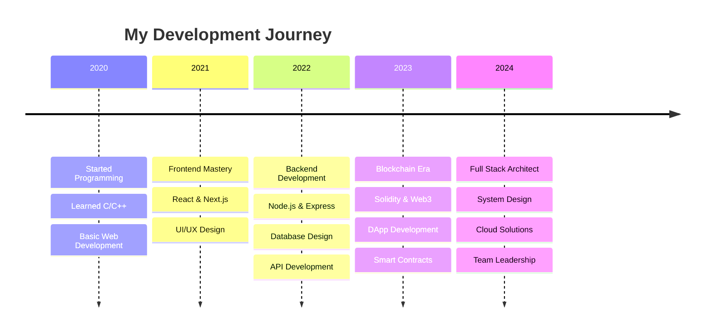

<div align="center">
  
</div>

<div align="center">
  
</div>

<div align="center">
  
</div>

---

<div align="center">
  
</div>

## 🌟 **About Me**

<div align="center">
  
</div>

<div align="center">
  <table>
    <tr>
      <td>
        
      </td>
      <td>

```typescript
class PrajwolKoirala extends Developer {
  constructor() {
    super();
    this.name = "Prajwol Koirala";
    this.title = "Full Stack Wizard 🧙‍♂️";
    this.location = "Nepal 🇳🇵";
    this.experience = "4+ years of digital sorcery";
    this.motto = "Code is art, bugs are just happy accidents! 🎨";
  }

  getCurrentStatus(): string {
    return "Transforming caffeine into code ☕ → 💻";
  }

  getSuperpowers(): string[] {
    return [
      "🚀 Building scalable applications",
      "⛓️ Crafting blockchain solutions", 
      "🎨 Creating pixel-perfect UIs",
      "🔧 Architecting robust systems",
      "🌟 Turning ideas into reality"
    ];
  }

  getLifePhilosophy(): string {
    return "Dream in code, debug in reality! 💭";
  }
}

const developer = new PrajwolKoirala();
console.log(developer.getCurrentStatus());
// Output: "Transforming caffeine into code ☕ → 💻"
```

      </td>
    </tr>
  </table>
</div>

<div align="center">
  
</div>

<div align="center">
  
### 🎯 **My Mission**
> *"To build technology that doesn't just work, but inspires and transforms lives"*

**🌟 Current Focus Areas:**
- 🔥 **DeFi Revolution** - Building next-gen financial protocols
- 🤖 **AI Integration** - Merging intelligence with blockchain
- 🌐 **Web3 Innovation** - Decentralizing the digital world
- 🎨 **UX Excellence** - Making complex simple and beautiful

</div>

---

<div align="center">
  
</div>

## 🛠️ **Tech Arsenal**

<div align="center">
  
  
  ### ⚡ **The Weapons of Mass Creation** ⚡
</div>

<div align="center">
  <table>
    <tr>
      <td align="center" width="50%">
        <br>
        
        
        
      </td>
      <td align="center" width="50%">
        <h3>🔥 **FRONTEND MASTERY** 🔥</h3>
        
        <br><br>
        
      </td>
    </tr>
  </table>
</div>

<div align="center">
  
</div>

<div align="center">
  <table>
    <tr>
      <td align="center" width="50%">
        <h3>⚡ **BACKEND POWERHOUSE** ⚡</h3>
        
        <br><br>
        
      </td>
      <td align="center" width="50%">
        
        <br>
        
        
      </td>
    </tr>
  </table>
</div>

<div align="center">
  
</div>

<div align="center">
  <table>
    <tr>
      <td align="center" width="50%">
        
        <br>
        
        
      </td>
      <td align="center" width="50%">
        <h3>⛓️ **BLOCKCHAIN WIZARD** ⛓️</h3>
        
        <br>
        
        
        <br>
        
        
      </td>
    </tr>
  </table>
</div>

<div align="center">
  
</div>

<div align="center">
  <table>
    <tr>
      <td align="center" width="50%">
        <h3>☁️ **CLOUD & DEVOPS NINJA** ☁️</h3>
        
        <br><br>
        
      </td>
      <td align="center" width="50%">
        
        <br>
        
        
      </td>
    </tr>
  </table>
</div>

<div align="center">
  
</div>

### 🎯 **Skill Level Breakdown**

<div align="center">
  <table>
    <tr>
      <td>
        
      </td>
      <td>

**🔥 Expert Level (90%+)**
- JavaScript/TypeScript 
- React/Next.js 
- Node.js 

**⚡ Advanced Level (75%+)**
- Blockchain/Solidity 
- System Design 
- DevOps/Cloud 

      </td>
    </tr>
  </table>
</div>

---

## 📊 **GitHub Analytics**

<div align="center">
  
  
</div>

<div align="center">
  
</div>

<div align="center">
  
</div>

---

## 🐍 **Contribution Snake - Watch My Commits Get Devoured!**

<div align="center">
  
</div>

<div align="center">
  
  
  ### 🔥 **The Snake That Eats My Code Commits!** 🔥
  *Watch as this hungry snake devours all my GitHub contributions - because even my commits deserve to be consumed by something cool!*
</div>

---

## 🏆 **Achievements & Trophies**

<div align="center">
  
</div>

---

## 🚀 **Featured Projects**

<div align="center">

### 🌾 **Agriculture Supply Chain DApp**
[](https://github.com/PrajwolKoirala/agriculture-supply-chain)

**Tech Stack:** Solidity, React, Web3.js, IPFS  
**Features:** End-to-end traceability, Smart contracts, Decentralized storage

### 🎉 **KUfest - University Event Platform**
[](https://github.com/PrajwolKoirala/KUfest)

**Tech Stack:** Next.js, Node.js, MongoDB, Socket.io  
**Features:** Real-time updates, Event management, Interactive UI

</div>

---

## 💼 **Professional Journey**

<div align="center">



</div>

---

## 🎯 **Current Focus**

<div align="center">
  <table>
    <tr>
      <td align="center" width="50%">
        <h3>🔥 What I'm Building</h3>
        <ul align="left">
          <li>🚀 Next-gen DeFi Protocol</li>
          <li>🤖 AI-powered Code Assistant</li>
          <li>🌐 Decentralized Social Platform</li>
          <li>📱 Cross-platform Mobile App</li>
        </ul>
      </td>
      <td align="center" width="50%">
        <h3>📚 Currently Learning</h3>
        <ul align="left">
          <li>🧠 Machine Learning & AI</li>
          <li>🔐 Advanced Cryptography</li>
          <li>☁️ Kubernetes & DevOps</li>
          <li>🎨 Advanced Animation (Framer Motion)</li>
        </ul>
      </td>
    </tr>
  </table>
</div>

---

## 🌐 **Connect With Me**

<div align="center">
  
[](https://www.linkedin.com/in/prajwol-koirala-6aa066235/)
[](https://twitter.com/YOUR_TWITTER)
[](https://YOUR_PORTFOLIO)
[](mailto:your.email@gmail.com)
[](https://discord.gg/YOUR_DISCORD)

</div>

---

## 💡 **Fun Facts**

<div align="center">
  
  
  - 🎯 I debug code faster than I debug my life
  - 🌱 I believe in clean code and dirty coffee
  - 🎮 Gaming enthusiast & sports lover
  - 🌍 Open source contributor
  - 🎨 UI/UX perfectionist
  - 🚀 Always ready for the next challenge!
</div>

---

<div align="center">
  
</div>

<div align="center">
  
  
</div>

<div align="center">
  
</div>
```
