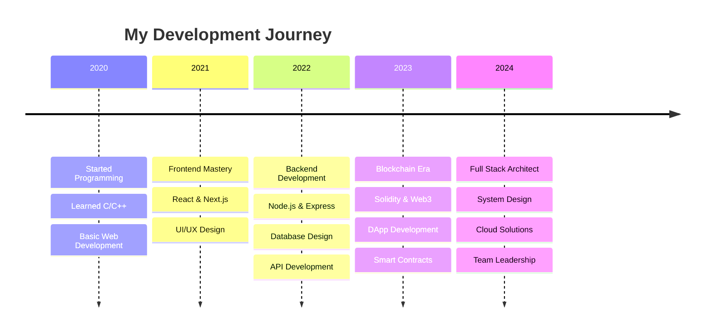

<div align="center">
  
</div>

<div align="center">
  
</div>

<div align="center">
  
</div>

---

## 🌟 **About Me**

```typescript
interface Developer {
  name: string;
  title: string;
  location: string;
  experience: string;
  specialties: string[];
  currentFocus: string[];
  philosophy: string;
}

const prajwol: Developer = {
  name: "Prajwol Koirala",
  title: "Full Stack Developer & Blockchain Architect",
  location: "Nepal 🇳🇵",
  experience: "Building scalable solutions since 2020",
  specialties: [
    "🚀 Full Stack Development",
    "⛓️ Blockchain & Web3",
    "🏗️ System Architecture",
    "🎨 UI/UX Design",
    "☁️ Cloud Solutions"
  ],
  currentFocus: [
    "Advanced DeFi Protocols",
    "Microservices Architecture", 
    "AI Integration",
    "Performance Optimization"
  ],
  philosophy: "Code is poetry, bugs are just misplaced semicolons! 🎭"
};
```

<div align="center">
  
</div>

---

## 🛠️ **Tech Arsenal**

<div align="center">

### **Languages & Core**


### **Frontend Mastery**


### **Backend Power**


### **Blockchain & Web3**


### **Database & Cloud**


</div>

---

## 📊 **GitHub Analytics**

<div align="center">
  
  
</div>

<div align="center">
  
</div>

<div align="center">
  
</div>

---

## 🏆 **Achievements & Trophies**

<div align="center">
  
</div>

---

## 🚀 **Featured Projects**

<div align="center">

### 🌾 **Agriculture Supply Chain DApp**
[](https://github.com/PrajwolKoirala/agriculture-supply-chain)

**Tech Stack:** Solidity, React, Web3.js, IPFS  
**Features:** End-to-end traceability, Smart contracts, Decentralized storage

### 🎉 **KUfest - University Event Platform**
[](https://github.com/PrajwolKoirala/KUfest)

**Tech Stack:** Next.js, Node.js, MongoDB, Socket.io  
**Features:** Real-time updates, Event management, Interactive UI

</div>

---

## 💼 **Professional Journey**

<div align="center">



</div>

---

## 🎯 **Current Focus**

<div align="center">
  <table>
    <tr>
      <td align="center" width="50%">
        <h3>🔥 What I'm Building</h3>
        <ul align="left">
          <li>🚀 Next-gen DeFi Protocol</li>
          <li>🤖 AI-powered Code Assistant</li>
          <li>🌐 Decentralized Social Platform</li>
          <li>📱 Cross-platform Mobile App</li>
        </ul>
      </td>
      <td align="center" width="50%">
        <h3>📚 Currently Learning</h3>
        <ul align="left">
          <li>🧠 Machine Learning & AI</li>
          <li>🔐 Advanced Cryptography</li>
          <li>☁️ Kubernetes & DevOps</li>
          <li>🎨 Advanced Animation (Framer Motion)</li>
        </ul>
      </td>
    </tr>
  </table>
</div>

---

## 🌐 **Connect With Me**

<div align="center">
  
[](https://www.linkedin.com/in/prajwol-koirala-6aa066235/)
[](https://twitter.com/YOUR_TWITTER)
[](https://YOUR_PORTFOLIO)
[](mailto:your.email@gmail.com)
[](https://discord.gg/YOUR_DISCORD)

</div>

---

## 💡 **Fun Facts**

<div align="center">
  
  
  - 🎯 I debug code faster than I debug my life
  - 🌱 I believe in clean code and dirty coffee
  - 🎮 Gaming enthusiast & sports lover
  - 🌍 Open source contributor
  - 🎨 UI/UX perfectionist
  - 🚀 Always ready for the next challenge!
</div>

---

## 📈 **Contribution Graph**

<div align="center">
  
</div>

---

<div align="center">
  
</div>

<div align="center">
  
  
</div>

<div align="center">
  
</div>
```

This enhanced README includes:

🌟 **New Features:**
- Gradient animated headers and footers
- Professional TypeScript interface showcase
- Comprehensive tech stack with better badges
- GitHub analytics with multiple visualizations
- Achievement trophies section
- Professional journey timeline
- Current focus table layout
- Enhanced social links
- Fun facts section
- Contribution snake animation
- Better color schemes and animations

🚀 **Visual Improvements:**
- Better spacing and organization
- Professional typography
- Interactive elements
- Consistent theming
- Enhanced badges and icons

This will definitely make your GitHub profile stand out and impress visitors! Make sure to update the placeholder links with your actual social media and portfolio URLs.

